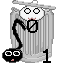
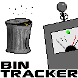
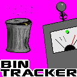
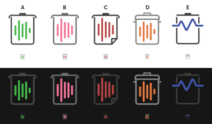

# Fan Art

## Bintracker Logo Challenge

This little informal challenge to design a logo for Bintracker took place in July 2019 on [Battle of the Bits](https://battleofthebits.org). The inspiration was this:

**[argarak](https://battleofthebits.org/barracks/Profile/argarak)**

**[Chip Champion](https://battleofthebits.org/barracks/Profile/Chip+Champion)**

**[flaminglog](https://battleofthebits.org/barracks/Profile/flaminglog)**

**[shinyjiggly](https://battleofthebits.org/barracks/Profile/shinyjiggly/)**

**[TristEndo](https://battleofthebits.org/barracks/Profile/TristEndo)**

 

**[Xu](https://battleofthebits.org/barracks/Profile/Xu)**

 

And some prototypes of the final winner by **[LionsTigersnDice](https://battleofthebits.org/barracks/Profile/LionsTigersnDice)**

