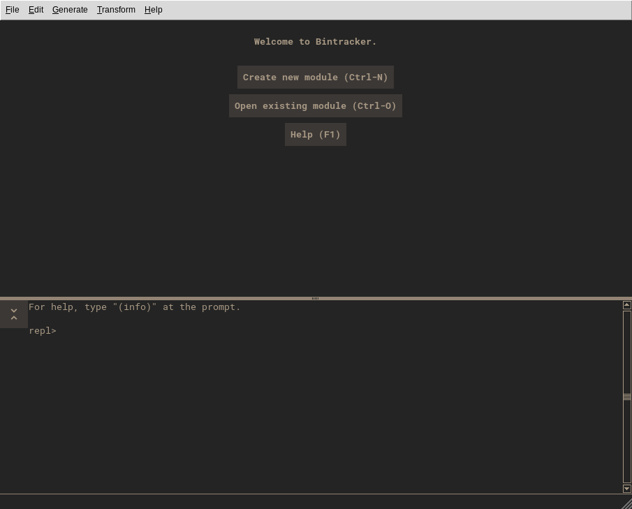
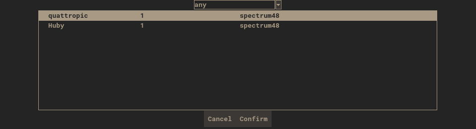
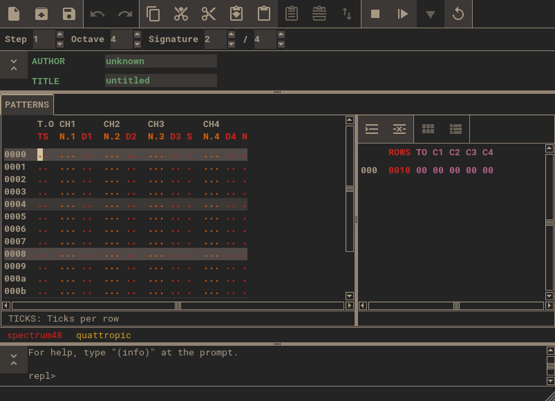
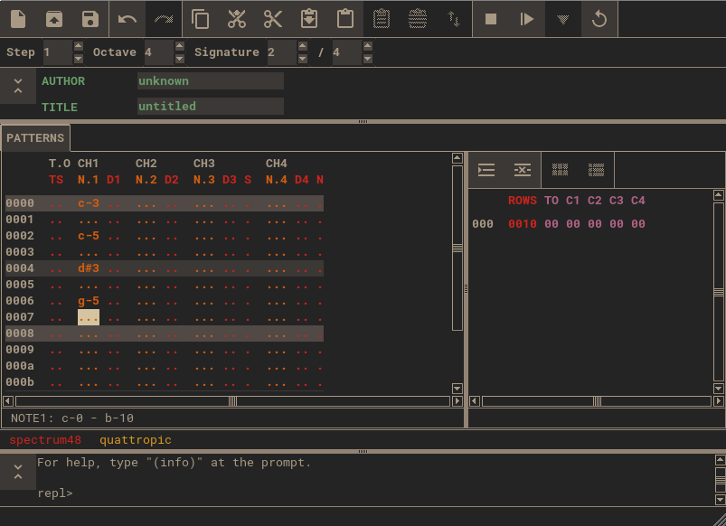
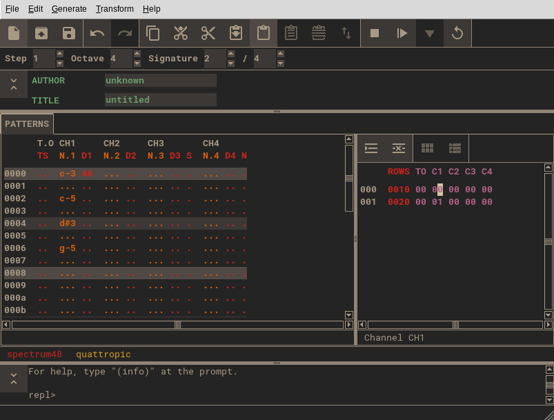
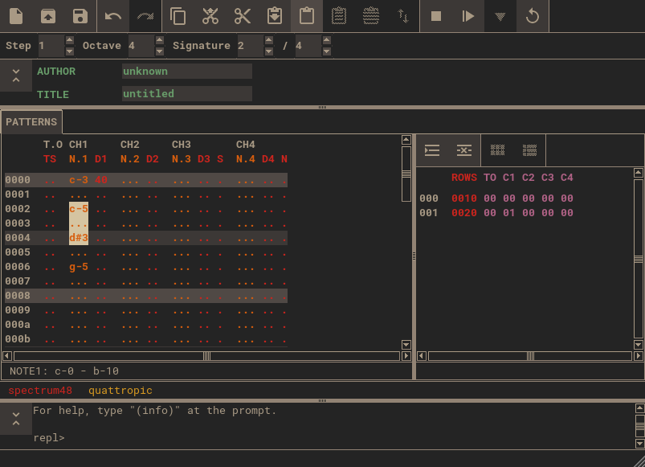
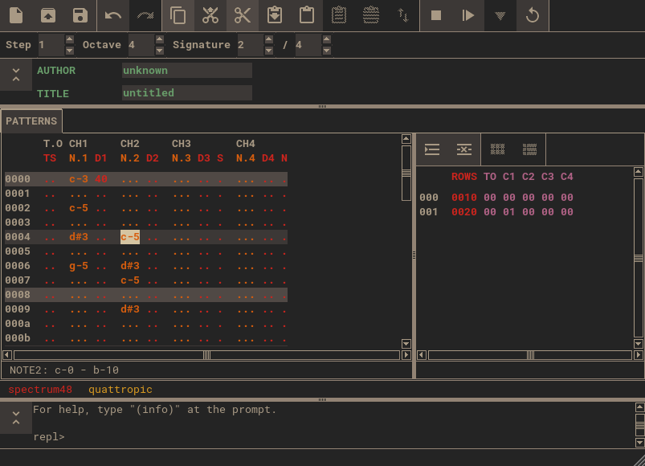
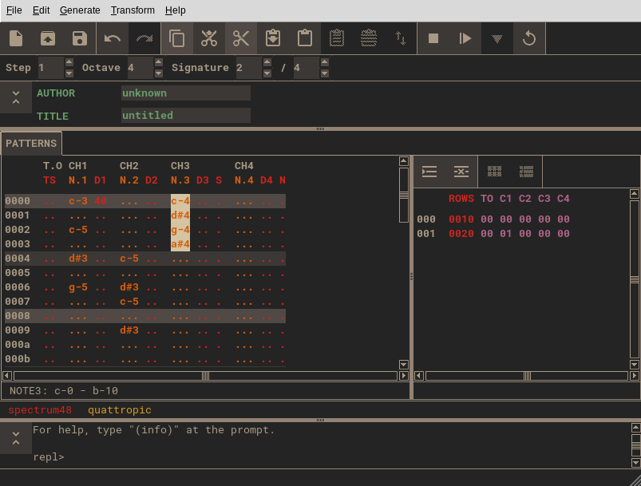
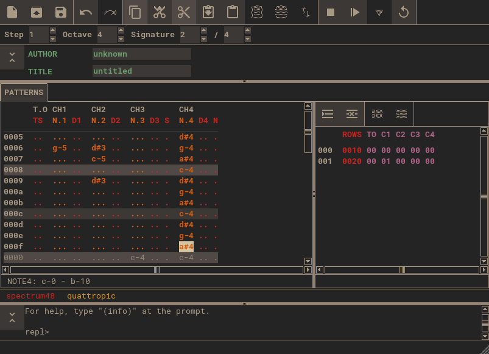

# Quickstart Tutorial

In this tutorial, we will create a simple track for the Quattropic 1-bit engine for the ZX Spectrum beeper. We will only touch on some basic features of Bintracker. For a deeper dive, refer to the remainder of this [User Manual](about.md).

## Words of Caution

1. Bintracker looks and feels like a tracker. However, it is actually a powerful interpreter that runs a tracker app, among other things. Be alert when using it, like you would when browsing the internet or opening email attachments. **As a rule of thumb, never open files, install add-ons, or run code snippets from untrusted sources on the internet in Bintracker, unless you have checked them and understand what they do.**

2. Bintracker isn't finished yet. At the moment, it's more like a giant construction site plagued by a serious disregard for safety measures. So, better bring a helmet. Save often and don't expect things to "just work".

## Prerequisites

This tutorial assumes that you have used a tracker before, and understand the general workflow, as well as some basic tracker jargon.

## Set up Bintracker

There is currently no easy path to setting up Bintracker. For now, you'll have to build Bintracker from source and configure a few things manually. Follow the [setup guide](setup.md) to get Bintracker up and running.

## Startup

Launch Bintracker by double-clicking the `bintracker` executable, or launch it from the command line. The second option will allow you to see debug messages and low level errors, which is helpful when you're trying to figure out why Bintracker crashes.

On startup, Bintracker greets you with this welcome screen:

Click the "New File..." button, or type `Ctrl-n`. This brings up the engine (sound routine) selection dialog.

For this tutorial, we'll choose the Quattropic engine. Select "quattropic" from the list of available engines, then click Confirm or hit `Enter`. A new, empty module replaces the welcome screen, and an instance of the MAME ZX Spectrum emulator opens in a new window.

## Module View

The Module View is the main display of your song. The layout of the module view depends on the engine you use. For Quattropic, we get a display with three panels, which are called *buffers* in Bintracker. Resize buffers as needed.

The horizontal buffer on top contains some global parameters of the module, such as the track title and the auther name. Parameters are called *fields* in Bintracker. We'll ignore the global field buffer for now.

The other two buffers are in a tab labelled "PATTERNS", below the global field buffer. On the left, there are the actual patterns, and on the right, there is the song sequence, also known as order list.

## Editing

### Navigation

You can navigate within a buffer by clicking with the mouse, with the arrow keys, as well as the `Home` and `End` buttons. You can jump to a different buffer by clicking on it with the mouse, or pressing `Ctrl-Tab` to cycle through buffers. The status line at the end of pattern and sequence buffers tells you more about the function of the column that the cursor is currently on.

Navigate to the second column in the pattern buffer, which is labelled "N.1". The status line will now read "NOTE1: c-0 - b-10". This tells you that this is a note column, with a note range from C-0 to B-10.

### Entering Notes and Parameters

Once you are in the NOTE1 column, you can start entering a simple melody. Like with all trackers, note keys are mapped to your keyboard in a piano-like manner. Pressing `1` enters a rest. Pressing shift while entering notes will reach one octave below the current base octave on the lower part of the keyboard, and one octave above on the upper part.

Press `F5` or click the Play From Start button  to play the notes you have entered. Press `F8` or click the Stop button  to stop playback.

Next to the NOTE1 column, there is a column labelled D1. On this column, you can set the [duty cycle](https://en.wikipedia.org/wiki/Duty_cycle) for channel 1. This is two digit (8-bit) hexadecimal value (you can change to decimal in the [config file](configuration.md)). Enter the value `40` on the first row of the D1 column. This changes the duty cycle to 25%. Play the song again to hear the difference.

### Edit the Song Sequence

Press `Control-Tab` or click with the mouse to change to the sequence buffer. Move the cursor around to see the description for the columns.

The first column in any sequence is always the step length. Bintracker does not have a concept of pattern length - patterns are infinite by default. You tell Bintracker how many rows of a given set of patterns you want to play on a given step in the sequence.

Change the value in the first column to `0020`. Your patterns now appear twice as long.

The remaining 5 columns represent the five channels of Quattropic. (It may appear like there are only four channels, but in fact the Tempo column is a separate channel.)

Go to the third column (labelled `C1`), and change the value to `01`. Whoops, your notes disappeared! Don't worry, we'll fix this in a bit. Before that, there's one important thing to know: Pattern numbers in Bintracker are unique per channel. This means that pattern `00` on `C1` is different from pattern `00` on `C2`.

Let's insert a new sequence step by pressing `Control-Insert`, or clicking the Insert Row button .

Now, change the first step on `C1` back to `00`. Your melody reappears to the left.

### Copy&Paste

Navigate back to the pattern buffer. Put the cursor on the first note you entered in the NOTE1 column. Hold `Shift` and press the down arrow to select a few more notes.

Now, release the `Shift` key, and press `Ctrl-c` or click the Copy button  to copy the selection to the clipboard. Navigate to the column labelled `N.2` and press `Ctrl-v` or click the Paste button  to paste the clipboard contents.

Navigate to the start of the pasted section, and press `Ctrl-v` again. Huh? Nothing happened, except the cursor moved! This is because *pasting* and *inserting* are two different things in Bintracker. *Pasting* replaces the current contents. It does not shift contents around. We just pasted the same contents twice, in the same spot, so nothing actually changed the second time.

*Inserting*, on the other hand, does shift contents. Move the cursor to a row above the pasted section, and press `Control-Shift-v` or click the Insert button . Voilà.

The same distinction applies to *clearing* and *cutting*. *Clearing* deletes the selection contents without shifting the following data. *Cutting* does actually cut out the selection, shifting up content that follows the selection. Both clearing and cutting copy the selection to the clipboard first.

To clear a selection, press `Ctrl-x` or click the Clear button . To cut a selection, press `Ctrl-Shift-x` or click the Cut button .

### Fill

Here's a little trick. In one of the note columns, enter three consecutive, different notes. Copy those three notes to the clipboard.

Now go to the first row of another note column, and press `Shift-End` to create a selection from the first to the last row of the pattern. Now paste the clipboard contents. The three notes are repeated across the pattern, creating a manual arpeggio.

When you create a selection and then paste or insert, the clipboard contents will be adjusted to fit the selection, dropping or repeating values as needed.

## Saving and Exporting

Press `Ctrl-s` or click the Save button  to save your tune. Bintracker will prompt you for a file name.

To export your song, go to the `File` menu, and chose `Export...` > `.bin` to export your tune as an executable. Bintracker currently only supports raw binaries.

Congratulations, you have made it to the end of this tutorial. Have fun, explore, and remember to save often, because Bintracker will crash sooner than later at this point in its development.
